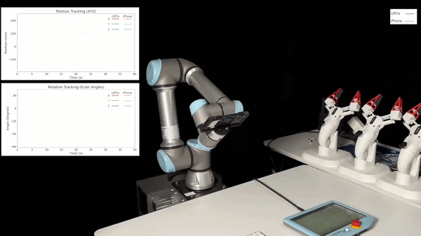

# asRoBallet MuJoCo

This work presents **asRoBallet**, a holistic system that overcomes the historical barriers to deploying reinforcement learning on underactuated spherical robots. By closing the *Reality Gap* inherent in the complex tribology of wheel-sphere-ground interactions, we, to the best of our knowledge, achieved the *first* end-to-end RL locomotion policy deployed on a humanoid ballbot hardware platform. This work has been accepted for publication at Robotics: Science and Systems 2026 in Sydney, Australia. [Please refer to the end of the page to cite this work](https://arxiv.org/abs/2604.24916).


`asRoBallet_mujoco` is a MuJoCo-based reinforcement learning project for a humanoid ballbot with an omni-wheel drive mechanism. The repository contains the robot model, mesh assets, two Gymnasium environments, and a shared PPO training entry point.

The robot model is defined in `asRoBallet.xml`. It includes the main body, upper-body links, a ball, three omni-wheel actuators, onboard sensor sites, and STL mesh assets under `meshes/`.

<p align="center">
  
  
</p>

## [asMagic App](https://apps.apple.com/us/app/asmagic/id6661033548)

This work adopts [**asMagic**](https://apps.apple.com/us/app/asmagic/id6661033548), a mobile app that transforms iOS devices into high-performing perception stack for real-time perception, communication, simulation, and interaction with advanced robotics. Feel free to [download the app](https://apps.apple.com/us/app/asmagic/id6661033548) for a 3D inspection of asRoBallet's design, which is reconfigured from the original design of asOverDog. Each asRoBallet only requires a single iPhone Pro series to achieve full-stack perception, which can be wirelessly interacted using another iPhone. Please refer to [the documentation](https://doc.ancoraspring.com) for further details on using asMagic for your project.

<p align="center">
    
    
    
</p>

## Project Structure

```text
.
├── asRoBallet.xml              # MuJoCo robot model
├── meshes/                     # STL mesh assets referenced by the XML
├── velocity_tracking_env.py    # Velocity-tracking Gymnasium environment
├── station_keeping_env.py      # Station-keeping Gymnasium environment
├── train.py                    # Shared PPO training script for both tasks
├── README.md
└── LICENSE
```

## Tasks

### Velocity Tracking

`velocity_tracking_env.py` trains the robot to follow commanded planar velocity and yaw-rate targets.

- Action space: 3 continuous wheel commands.
- Observation size: 16.
- Default episode length: 1000 environment steps.
- Default training horizon: 4,000,000 PPO timesteps.
- Reward terms include velocity tracking, angular-velocity penalty, action energy, and action-rate penalty.

### Station Keeping

`station_keeping_env.py` trains the robot to remain near its initial position and heading.

- Action space: 3 continuous wheel commands.
- Observation size: 17.
- Default episode length: 2000 environment steps.
- Default training horizon: 4,000,000 PPO timesteps.
- Reward terms include position/yaw retention, roll-pitch penalty, angular-velocity penalty, action energy, and action-rate penalty.

## Installation

Create and activate a virtual environment:

```bash
conda create -n asroballet python=3.11
conda activate asroballet
pip install gymnasium numpy mujoco glfw scipy stable-baselines3 tensorboard tqdm rich
```

## Training

Use the shared training script and pass the task name.

Train the velocity-tracking task:

```bash
python train.py velocity_tracking
```

Train the station-keeping task:

```bash
python train.py station_keeping
```

Useful options:

```bash
python train.py velocity_tracking --total-timesteps 100000
python train.py station_keeping --n-envs 4 --seed 3407
python train.py velocity_tracking --xml-file asRoBallet.xml --log-root logs
```

Show all options:

```bash
python train.py --help
```

Training logs and best models are written under:

```text
logs/<task_name>/
└── best_by_eprew/
    └── best_model.zip
```

TensorBoard can be launched with:

```bash
tensorboard --logdir logs
```

## Contact Friction Parameters
MuJoCo uses different friction layouts for `geom` defaults and explicit contact `pair` definitions.

The ball-floor contact is defined in `asRoBallet.xml` by the named contact pair:

```xml
<pair name="ball_floor" geom1="ball-v1_geom" geom2="floor"
      condim="6" friction="1.0 1.0 0.01"
      solimp="0.85 0.99 0.003" />
```

The friction vector is:

```text
friction="mu_slide_1 mu_slide_2 mu_torsion mu_roll_1 mu_roll_2"
```

- `mu_slide_1`, `mu_slide_2`: tangential Coulomb friction coefficients for the two sliding directions.
- `mu_torsion`: resistance to spinning about the contact normal. With `condim="6"`, this term is enabled and affects yaw-like spin at the contact patch.
- `mu_roll_1`, `mu_roll_2`: rolling-friction coefficients for the two rolling directions.

`condim="6"` enables sliding, torsional, and rolling friction at the ball-floor contact. The default XML values are:

```text
mu_slide_1 = 1.0
mu_slide_2 = 1.0
mu_torsion = 0.01
mu_roll_1  = inherited/default value
mu_roll_2  = inherited/default value
```

The ball-floor contact is defined in `asRoBallet.xml` by the `geom`
```xml
<default class="rubber">
    <geom rgba="0.2 0.2 0.2 1" condim="3" friction="1 0.005 0.0001" priority="1" solimp="0.85 0.99 0.003"/>
</default>
```
The friction vector is:

```text
friction="mu_slide mu_torsion mu_roll"
```

During training, both environments randomize the first contact pair in `rand_dynamics()`:

```python
self.model.pair_friction[0][0] = self.rng.uniform(low=0.6, high=1.2)
self.model.pair_friction[0][1] = self.model.pair_friction[0][0]
```

The wheel joint dry-friction losses are also randomized:

```python
self.model.dof_frictionloss[ACTUATOR_INDEX] = self.rng.uniform(low=0.08, high=0.12, size=(3,))
```

This randomizes drivetrain resistance for the three omni-wheel joints.

## Notes

- The MuJoCo timestep in `asRoBallet.xml` is `0.002` seconds.
- The environments use `frame_skip=5`, so one policy step advances `0.01` seconds of simulation time.
- Both tasks control only the first three actuators, corresponding to the three omni-wheel motors.
- Head and arm joints are position-controlled by the XML actuators and randomized during some resets.

## Citation

```
@inproceedings{Wan2026asRoBallet,
  title={\href{https://arxiv.org/abs/2604.24916}
    {asRoBallet: Closing the Sim2Real Gap via Friction-Aware Reinforcement Learning for Underactuated Spherical Dynamics}},
  author={Fang Wan and Guangyi Huang and Tianyu Wu and Zishang Zhang and Bangchao Huang and Haoran Sun and Mingdong Chen and Chaoyang Song},
  booktitle={Robotics: Science and Systems (RSS)},
  year={2026}
}
```
