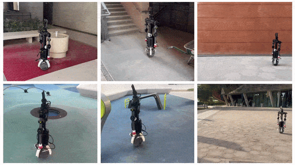
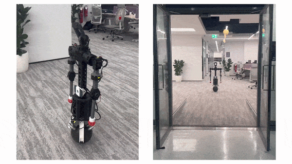
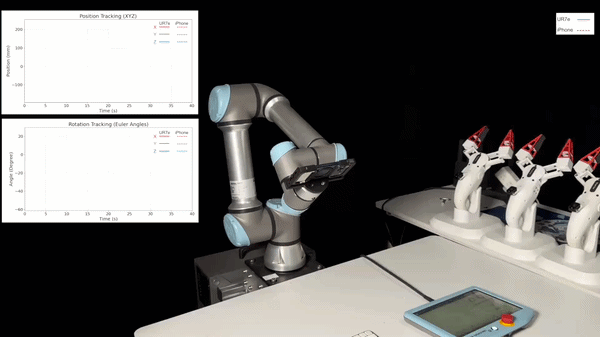

# asRoBallet MuJoCo

This work presents **asRoBallet**, a holistic system that overcomes the historical barriers to deploying reinforcement learning on underactuated spherical robots. By closing the *Reality Gap* inherent in the complex tribology of wheel-sphere-ground interactions, we, to the best of our knowledge, achieved the *first* end-to-end RL locomotion policy deployed on a humanoid ballbot hardware platform. This work has been accepted for publication at Robotics: Science and Systems 2026 in Sydney, Australia. [Please refer to the end of the page to cite this work](https://arxiv.org/abs/2604.24916).


`asRoBallet_mujoco` is a MuJoCo-based reinforcement learning project for a humanoid ballbot with an omni-wheel drive mechanism. The repository contains the robot model, mesh assets, two Gymnasium environments, and a shared PPO training entry point.

The canonical robot model is defined in `robots/mjcf/asRoBallet.xml`. It includes the main body, upper-body links, a ball, three omni-wheel actuators, onboard sensor sites, and STL mesh assets under `robots/meshes/`. Training, evaluation, and playback use `robots/mjcf/scene.xml`, which includes the robot and adds the floor, ball-floor contact pair, light, and viewer camera. The previous robot model is retained under `robots/.archive/`.

<p align="center">
  
  
</p>

## [asMagic App](https://apps.apple.com/us/app/asmagic/id6661033548)

This work adopts [**asMagic**](https://apps.apple.com/us/app/asmagic/id6661033548), a mobile app that transforms iOS devices into high-performing perception stack for real-time perception, communication, simulation, and interaction with advanced robotics. Feel free to [download the app](https://apps.apple.com/us/app/asmagic/id6661033548) for a 3D inspection of asRoBallet's design, which is reconfigured from the original design of asOverDog. Each asRoBallet only requires a single iPhone Pro series to achieve full-stack perception, which can be wirelessly interacted using another iPhone. Please refer to [the documentation](https://doc.ancoraspring.com) for further details on using asMagic for your project.

<p align="center">
    
    
    
</p>

## Project Structure

```text
.
├── assets/                     # Images, GIFs, and other README media
├── robots/                     # Robot descriptions and mesh assets
│   ├── mjcf/
│   │   ├── asRoBallet.xml      # Pure MuJoCo robot model
│   │   └── scene.xml           # Training/evaluation scene including floor/contact
│   ├── usd/                    # Generated OpenUSD Atomic Component
│   ├── .archive/               # Previous robot model revisions
│   └── meshes/                 # STL mesh assets referenced by the MJCF
├── envs/
│   ├── base.py                 # Shared MuJoCo environment lifecycle
│   ├── velocity_tracking.py    # Velocity-tracking Gymnasium environment
│   └── station_keeping.py      # Station-keeping Gymnasium environment
├── scripts/
│   ├── train.py                # Shared PPO training script for both tasks
│   ├── evaluate.py             # Headless multi-episode policy evaluation
│   ├── play.py                 # Real-time MuJoCo policy playback
│   ├── export_onnx.py          # Export SB3 policies to ONNX
│   └── export_usd.py           # Convert MJCF assets to OpenUSD
├── README.md
└── LICENSE
```

## Tasks

### Velocity Tracking

`envs/velocity_tracking.py` trains the robot to follow commanded planar velocity and yaw-rate targets.

- Action space: 3 continuous wheel commands.
- Observation size: 16.
- Default episode length: 1000 environment steps.
- Default training horizon: 4,000,000 PPO timesteps.
- Reward terms include velocity tracking, angular-velocity penalty, action energy, and action-rate penalty.

### Station Keeping

`envs/station_keeping.py` trains the robot to remain near its initial position and heading.

- Action space: 3 continuous wheel commands.
- Observation size: 17.
- Default episode length: 2000 environment steps.
- Default training horizon: 4,000,000 PPO timesteps.
- Reward terms include position/yaw retention, roll-pitch penalty, angular-velocity penalty, action energy, and action-rate penalty.

## Installation

The repository is tested with Python 3.11 in the `asroballet` Conda environment.

Create the environment and install all runtime, training, and logging dependencies:

```bash
conda create -n asroballet python=3.11
conda activate asroballet
pip install -r requirements.txt
```

## Training

`scripts/train.py` is the shared PPO entry point for both tasks:

```bash
python scripts/train.py velocity_tracking
python scripts/train.py station_keeping
```

The default configuration for either task is:

- `robots/mjcf/scene.xml`
- 8 parallel environments
- 4,000,000 global environment transitions
- seed `3407`
- CUDA execution
- a periodic checkpoint every 100,000 global transitions

Only one full training job should normally use a single GPU at a time. On a machine without a
CUDA-capable PyTorch installation, select the CPU explicitly:

```bash
python scripts/train.py velocity_tracking --device cpu
```

Common overrides can be combined in one command:

```bash
python scripts/train.py velocity_tracking \
  --n-envs 4 \
  --total-timesteps 1000000 \
  --checkpoint-freq 50000 \
  --seed 3407 \
  --device cuda
```

`--checkpoint-freq` is measured in global transitions across all parallel environments. The
trainer accounts for `--n-envs` when configuring the Stable-Baselines3 checkpoint callback.

GUI training is intended for debugging, not throughput. It requires exactly one environment:

```bash
python scripts/train.py station_keeping --gui --n-envs 1
```

Each invocation creates an isolated timestamped run:

```text
logs/<task>/<YYYY-MM-DD_HH-MM-SS>/
├── tensorboard/
│   └── events.out.tfevents.*
├── monitor/
│   ├── 0.monitor.csv
│   └── ...
└── checkpoints/
    ├── model_<timesteps>_steps.zip
    ├── best_model.zip
    └── final_model.zip
```

- `model_<timesteps>_steps.zip` is a retained periodic checkpoint.
- `best_model.zip` is overwritten when the rolling mean episodic return improves within that run.
- `final_model.zip` is written only after training finishes normally.

All three are native Stable-Baselines3 archives and can be loaded with `PPO.load()`. Monitor CSV
files contain episode returns and lengths for each parallel environment. TensorBoard also records
PPO metrics and the environment reward components:

```bash
tensorboard --logdir logs
```

Use the CLI help for the complete option list:

```bash
python scripts/train.py --help
```

## Evaluation

`scripts/evaluate.py` performs repeatable headless policy evaluation. It defaults to five deterministic
episodes on the CPU and reports:

- reward, length, and termination status for every episode
- mean, standard deviation, minimum, and maximum reward and length
- per-episode sums and summary statistics for every value in `info["reward_parts"]`

Evaluate the newest best checkpoint for either task:

```bash
python scripts/evaluate.py velocity_tracking
python scripts/evaluate.py station_keeping
```

When `--model-path` is omitted, the evaluator searches timestamped runs from newest to oldest and
loads the newest existing `checkpoints/best_model.zip`. It retains a fallback for logs generated
by the former `best_by_eprew/` layout.

Use an explicit path to evaluate a periodic, best, or final checkpoint:

```bash
python scripts/evaluate.py station_keeping \
  --model-path logs/station_keeping/2026-08-12_15-30-45/checkpoints/final_model.zip \
  --episodes 10 \
  --max-steps 2000 \
  --device cpu
```

Deterministic actions are the default. Use `--stochastic` only when policy sampling is part of the
evaluation:

```bash
python scripts/evaluate.py velocity_tracking --stochastic
```

## ONNX Export

```bash
python scripts/export_onnx.py velocity_tracking
python scripts/export_onnx.py station_keeping
```

The exporter uses the newest `best_model.zip` by default and writes `best_model.onnx` beside it.
Use `--model-path`, `--output-path`, and `--force` to override these paths. The ONNX interface is
`observations: float32[batch, 16|17] -> actions: float32[batch, 3]`. New policies use ELU and the
exported graph contains only two `warp_nn.runtime.OnnxRuntime`-compatible operators: `Gemm` and
`Elu`. Apply the action-space clamp in the runtime before sending actions to the robot. Existing
checkpoints trained with Tanh cannot be converted exactly and must be retrained. Model structure
and weights are stored in a single `.onnx` file.

## OpenUSD Export

```bash
python scripts/export_usd.py
```

This converts `robots/mjcf/asRoBallet.xml` with Newton's `mujoco-usd-converter` and writes the
self-contained Atomic Component to `robots/usd/asRoBallet.usda`. Use `--force` to
replace an existing export. Converter version 0.5.0 exports geometry, materials, bodies,
collisions, sites, joints, and actuators, but does not currently export MJCF sensors.

## Playback

```bash
python scripts/play.py velocity_tracking
python scripts/play.py station_keeping
```

`velocity_tracking` controls:

- `R`: reset
- `W` / `S`: increase / decrease forward velocity `vx`
- `A` / `D`: increase / decrease lateral velocity `vy`
- `Q` / `E`: increase / decrease yaw rate
- `Space`: zero all commands
- `Esc`: quit

`station_keeping` uses `R` to reset and `Esc` to quit. Playback runs continuously and loads the
newest `best_model.zip` by default. The camera follows the robot from the front.

Use a specific checkpoint with `--model-path`:

```bash
python scripts/play.py velocity_tracking \
  --model-path logs/velocity_tracking/2026-08-12_15-30-45/checkpoints/final_model.zip
```

## Contact Friction Parameters
MuJoCo uses different friction layouts for `geom` defaults and explicit contact `pair` definitions.

The ball-floor contact is defined in `robots/mjcf/scene.xml` by the named contact pair:

```xml
<pair name="ball_link_floor" geom1="ball_link_geom" geom2="floor"
      condim="6" friction="1.0 1.0 0.01"
      solimp="0.85 0.99 0.003" />
```

The friction vector is:

```text
friction="mu_slide_1 mu_slide_2 mu_torsion mu_roll_1 mu_roll_2"
```

- `mu_slide_1`, `mu_slide_2`: tangential Coulomb friction coefficients for the two sliding directions.
- `mu_torsion`: resistance to spinning about the contact normal. With `condim="6"`, this term is enabled and affects yaw-like spin at the contact patch.
- `mu_roll_1`, `mu_roll_2`: rolling-friction coefficients for the two rolling directions.

`condim="6"` enables sliding, torsional, and rolling friction at the ball-floor contact. The default XML values are:

```text
mu_slide_1 = 1.0
mu_slide_2 = 1.0
mu_torsion = 0.01
mu_roll_1  = inherited/default value
mu_roll_2  = inherited/default value
```

The robot-side rubber contact default is defined in `robots/mjcf/asRoBallet.xml` by the `geom`
```xml
<default class="rubber">
    <geom rgba="0.2 0.2 0.2 1" condim="3" friction="1 0.005 0.0001" priority="1" solimp="0.85 0.99 0.003"/>
</default>
```
The friction vector is:

```text
friction="mu_slide mu_torsion mu_roll"
```

During training, both environments resolve and randomize the named `ball_link_floor` contact pair
in `rand_dynamics()`:

```python
sliding_friction = self.rng.uniform(low=0.6, high=1.2)
self.model.pair_friction[self.ball_floor_pair_id, 0:2] = sliding_friction
```

The wheel joint dry-friction losses are also randomized:

```python
self.model.dof_frictionloss[self.controlled_dof_indices] = self.rng.uniform(
    low=0.08,
    high=0.12,
    size=self.controlled_dof_indices.shape,
)
```

`controlled_dof_indices` is resolved from the named wheel actuators and their joint transmissions,
so the mapping remains valid if actuator or joint ordering changes in the MJCF. This randomizes
drivetrain resistance for the three omni-wheel joints.

## Notes

- The MuJoCo timestep in `robots/mjcf/asRoBallet.xml` is `0.002` seconds.
- `robots/mjcf/scene.xml` is the default training/evaluation/playback entry point because it adds the floor and contact pair around the pure robot XML.
- The environments use `frame_skip=5`, so one policy step advances `0.01` seconds of simulation time.
- Both tasks control the three named omni-wheel motor actuators.
- head_link and arm joints are position-controlled by the XML actuators and randomized during some resets.

## Citation

```
@inproceedings{Wan2026asRoBallet,
  title={\href{https://arxiv.org/abs/2604.24916}
    {asRoBallet: Closing the Sim2Real Gap via Friction-Aware Reinforcement Learning for Underactuated Spherical Dynamics}},
  author={Fang Wan and Guangyi Huang and Tianyu Wu and Zishang Zhang and Bangchao Huang and Haoran Sun and Mingdong Chen and Chaoyang Song},
  booktitle={Robotics: Science and Systems (RSS)},
  year={2026}
}
```
